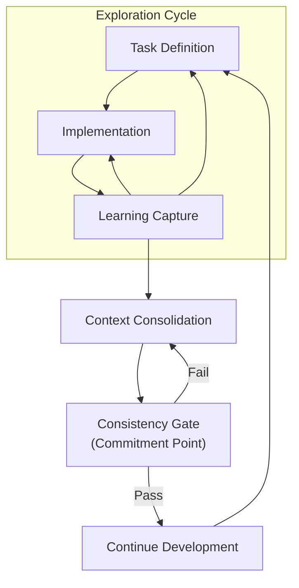

# Context-Driven Development Workflow — Operational Flow

This document focuses on the **dynamic behavior** of the Context-Driven Development Workflow:
how work flows, repeats, and commits over time.

For definitions, responsibilities, and invariants, see `docs/CDDW.md`.

---

## Workflow Dynamics

CDDW is not a linear sequence of steps.

It is a **cyclical workflow with an explicit commitment boundary**.

Some activities may repeat freely.
Others are mandatory before commitment is allowed.

---

## The Development–Learning Cycle

### How to Read This Diagram

- **Task Definition, Implementation, and Learning Capture** may repeat multiple times.
  Exploration, correction, and refinement are expected.

- **Context Consolidation** is not continuous by default.
  It becomes mandatory **before a commitment point**.

- A **Commitment Point** (as defined in CDE) activates a **Consistency Gate**:
  learning must be reviewed and either consolidated or explicitly rejected.

- If the gate fails, work returns to consolidation.
  Proceeding without passing the gate is a stop condition.

- Context Consolidation may occur opportunistically during exploration,
  but becomes mandatory when approaching a commitment point.

---

## Commitment Points

At certain moments, higher discipline is required.

Typical commitment points include:

- merging significant changes
- preparing a release
- handing work to another contributor or agent
- extending existing behavior

At commitment points:

- all required learning artifacts must exist
- relevant learning must be consolidated
- known inconsistencies must be resolved or explicitly recorded

Proceeding without consolidation at a commitment point is a stop condition.

A commitment point activates the same consistency expectations as defined in CDE:
downstream work may only proceed when context and implementation are aligned.

---

## Relationship to CDE Commitment Points

CDDW adopts the concept of **Commitment Points** from Context-Driven Engineering (CDE).

At these points:

- context must be internally consistent
- learning must be explicit
- downstream work may rely on upstream intent

CDDW provides a concrete mechanism for satisfying this requirement
by making learning capture and consolidation non-optional inputs to the gate.

---

## Responsibilities at a Glance

| Phase                 | Primary Responsibility |
|-----------------------|------------------------|
| Task Definition       | Human                  |
| Implementation        | Human and/or AI agent  |
| Learning Capture      | Implementation role    |
| Context Consolidation | Human                  |

Roles and behavioral expectations are defined in `AGENT_ROLES.md`.

---

## What This Workflow Optimizes For

CDDW optimizes for:

- preservation of conceptual coherence
- durability of learning
- safe parallel work by humans and AI agents
- long-term maintainability

It does **not** optimize for:

- maximum short-term speed
- minimal documentation
- eliminating human judgment

These trade-offs are intentional.

---

## Using This Document

Use this document:

- to align on “how we work”
- to onboard contributors or agents
- to detect when the workflow is being bypassed

If this document feels unnecessary,
it is often a signal that learning is still implicit.

---

## Final Note

CDDW is not a set of best practices.

It is a commitment to making learning visible,
judgment explicit,
and context durable.

If the loop breaks, coherence decays.
