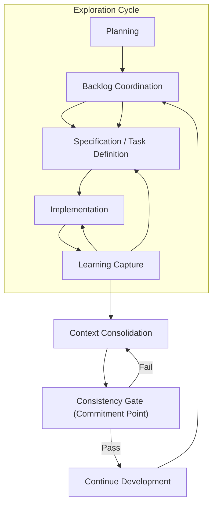

# Context-Driven Development Workflow — Operational Flow

This document focuses on the **dynamic behavior** of the Context-Driven Development Workflow:
how work flows, repeats, and commits over time.

For definitions, responsibilities, and invariants, see `docs/CDDW.md`.

A reference implementation of this workflow is available under `/starter/`.

## Contents

- [Workflow Dynamics](#workflow-dynamics)
- [Planning and Backlog Coordination](#planning-and-backlog-coordination)
- [The Development–Learning Cycle](#the-developmentlearning-cycle)
- [Parallel Work Lanes](#parallel-work-lanes)
- [Commitment Points](#commitment-points)
- [Relationship to CDE Commitment Points](#relationship-to-cde-commitment-points)
- [Integrity Audits](#integrity-audits)
- [Responsibilities at a Glance](#responsibilities-at-a-glance)
- [Learning Capture Discipline](#learning-capture-discipline)
- [What This Workflow Optimizes For](#what-this-workflow-optimizes-for)
- [Using This Document](#using-this-document)
- [Final Note](#final-note)

## Workflow Dynamics

CDDW is not a linear sequence of steps.

It is a **cyclical workflow with an explicit commitment boundary**.

Some activities may repeat freely.
Others are mandatory before commitment is allowed.

## Planning and Backlog Coordination

CDDW distinguishes between:

- **Planning** — defining sequencing, milestones, commitment strategy, and major risks
- **Backlog Coordination** — maintaining the current operational queue of candidate, selected, blocked, active, and completed work
- **Task Definition** — turning a selected work item into a bounded specification or equivalent execution contract

These responsibilities must not be collapsed into a single document.

In projects with small or mostly sequential work, backlog coordination may remain minimal.  
In projects with parallel work, BACKLOG.md is the preferred coordination surface between PLAN.md and active SPECs.

## The Development–Learning Cycle

```mermaid
flowchart TD
    P[Planning]
    B[Backlog Coordination]
    S[Specification / Task Definition]
    I[Implementation]
    L[Learning Capture]

    subgraph Exploration ["Exploration Cycle"]
        P --> B --> S --> I --> L
        L --> I
        L --> S
        B --> S
    end

    L --> C[Context Consolidation]
    C --> G["Consistency Gate (Commitment Point)"]
    G -->|Pass| E[Continue Development]
    G -->|Fail| C
    E --> B
```

### How to Read This Diagram

- **Task Definition, Implementation, and Learning Capture** may repeat multiple times.
  Exploration, correction, and refinement are expected.

- **Context Consolidation** is not continuous by default.
  It becomes mandatory **before a commitment point**.

- A **Commitment Point** (as defined in CDE) activates a **Consistency Gate**:
  learning must be reviewed and either consolidated or explicitly rejected.

- If the gate fails, work returns to consolidation.
  Proceeding without passing the gate is a stop condition.

- Context Consolidation may occur opportunistically during exploration,
  but becomes mandatory when approaching a commitment point.

### Parallel Work Lanes

When multiple contributors or agents work in parallel, backlog coordination should make active work explicit.

Recommended minimal discipline:

- keep active items visible in one shared backlog
- separate active work into lanes when this reduces ambiguity
- ensure each non-trivial active item links to a dedicated spec
- do not begin work that depends on unresolved shared-context contradictions

The goal is not process overhead.  
The goal is to prevent parallel implementation from creating invisible drift.

## Commitment Points

At certain moments, higher discipline is required.

Typical commitment points include:

- merging significant changes
- preparing a release
- handing work to another contributor or agent
- extending existing behavior

In projects using a backlog, the handoff state of active items and active specs must also be current before commitment is allowed.

At commitment points:

- all required learning artifacts must exist
- relevant learning must be consolidated
- known inconsistencies must be resolved or explicitly recorded

Proceeding without consolidation at a commitment point is a stop condition.

A commitment point activates the same consistency expectations as defined in CDE:
downstream work may only proceed when context and implementation are aligned.

## Relationship to CDE Commitment Points

CDDW adopts the concept of **Commitment Points** from Context-Driven Engineering (CDE).

At these points:

- context must be internally consistent
- learning must be explicit
- downstream work may rely on upstream intent

CDDW provides a concrete mechanism for satisfying this requirement
by making learning capture and consolidation non-optional inputs to the gate.

## Integrity Audits

A CDE Integrity Audit is an optional but recommended workflow activity that assesses whether context and implementation remain coherent over time.

Integrity audits are especially useful:

- before major releases
- before handoff to another contributor or agent
- after significant implementation volume
- after multiple parallel work lanes have been active
- when humans suspect that context is becoming stale
- before or during consolidation work

An integrity audit does not replace the Consistency Gate at a commitment point. It provides input to human review by making likely drift visible earlier.

The audit produces a Coherence Report using the project-defined integrity audit reference, such as `INTEGRITY_AUDIT.md` in the starter. The report summarizes coherence levels, evidence, risks, uncertainty, and suggested human review focus.

The report is advisory. Humans decide whether to consolidate context, revise specifications, update architecture, create follow-up work, or accept the current state.

## Responsibilities at a Glance

| Phase                 | Primary Responsibility |
|-----------------------|------------------------|
| Task Definition       | Human                  |
| Implementation        | Human and/or AI agent  |
| Learning Capture      | Implementation role    |
| Integrity Audit       | AI agent.              |
| Context Consolidation | Human                  |

Roles and behavioral expectations are defined in `AGENT_ROLES.md`.

## Learning Capture Discipline

When multiple learnings emerge from a single discovery event:

- Capture each learning that meets the threshold defined in `LEARNINGS.md`
- Keep each artifact focused on a single concern
- Use the "Consolidation Priority" field to indicate urgency

Multiple focused artifacts are preferable to one overloaded artifact or lost insights.

The goal is clarity, not minimalism.

## What This Workflow Optimizes For

CDDW optimizes for:

- preservation of conceptual coherence
- durability of learning
- safe parallel work by humans and AI agents
- long-term maintainability

It does **not** optimize for:

- maximum short-term speed
- minimal documentation
- eliminating human judgment

These trade-offs are intentional.

## Using This Document

Use this document:

- to align on “how we work”
- to onboard contributors or agents
- to detect when the workflow is being bypassed

If this document feels unnecessary,
it is often a signal that learning is still implicit.

## Final Note

CDDW is not a set of best practices.

It is a commitment to making learning visible,
judgment explicit,
and context durable.

If the loop breaks, coherence decays.
